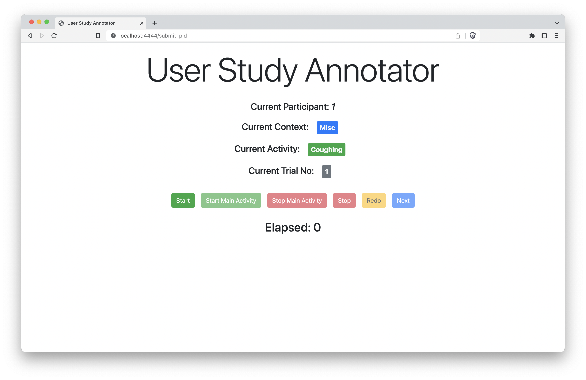

# User Study Annotator
A minimal, hackable annotator for user studies. Originally created for [_SAMoSA_ (IMWUT/Ubicomp 2022)](https://vimal-mollyn.com/research/samosa-sensing-activities-with-motion-and-sub-sampled-audio/).


## What's it good for?
Anytime you need to manually annotate user sensor data. For example, IMU data from smartwatches, smartphones, etc. This tool will log unix timestamps to a csv, which can later be synced to sensor data.

## How to use?
Tested with python3.8
```
python app.py 
```

## Dependencies
```
flask
```
